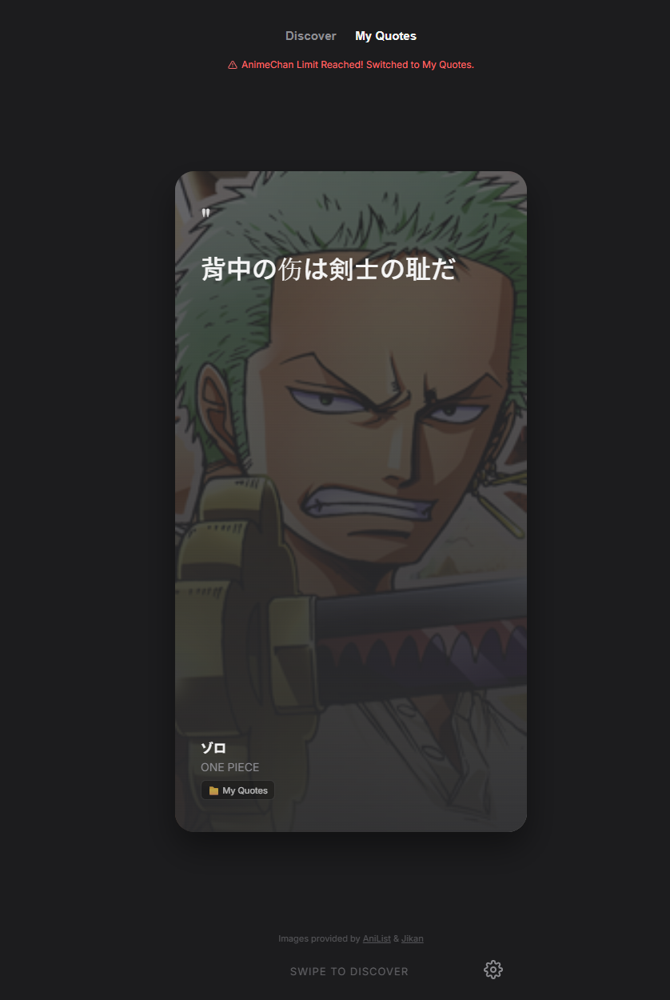

# AniQuote

> A swipe-based anime quote app built with Bun and TypeScript.  
> Discover random anime quotes, browse your own saved quotes, and manage a personal quote library with import/export support.



**Live Demo:** [Add your GitHub Pages / hosted demo link here](https://your-demo-link-here.com)

---

## About

AniQuote is a frontend-only quote app inspired by modern mobile card interfaces.  
Users can swipe through anime quotes, switch between quotes from AnimeChan and their own custom quote library, and manage their own quote collection locally in the browser.

This project uses:
- **AnimeChan** for random anime quotes
- **AniList** for anime / character image search
- **Jikan** as the fallback image source when AniList does not return a result

Special thanks to **AnimeChan**, **AniList**, and **Jikan** for making this project possible.

---

## Features

- Swipe-based quote card experience
- Random anime quotes from AnimeChan (free tier, rate limit handled gracefully)
- Personal quote library stored in browser local storage
- Import and export custom quotes as JSON
- Default built-in quotes loaded from `assets/quotes.json`
- AniList image lookup with Jikan fallback
- Responsive UI for mobile and desktop
- Static frontend project — easy to host anywhere

---

## Tech Stack

| Tool | Usage |
|---|---|
| Bun | Runtime, package manager, dev server |
| TypeScript | Language |
| Vite | Build tool |
| Axios | HTTP requests |
| Hammer.js | Touch swipe gestures |
| Feather Icons | UI icons |
| AniList GraphQL API | Character / anime image search |
| Jikan REST API | Fallback image source |
| AnimeChan API | Random anime quotes |

---

## Getting Started

### Prerequisites

Install Bun on your machine (Windows, macOS, or Linux).

**macOS / Linux:**
```bash
curl -fsSL https://bun.sh/install | bash
```

**Windows (PowerShell as Administrator):**
```powershell
irm bun.sh/install.ps1 | iex
```

Verify:
```bash
bun --version
```

---

### 1. Clone the project

```bash
git clone https://github.com/your-username/your-repo-name.git
cd your-repo-name
```

### 2. Install dependencies

```bash
bun install
```

### 3. Start the development server

```bash
bun run dev
```

The app will be available at `http://localhost:5173` by default.

---

## Build

Generate the production build:

```bash
bun run build
```

Preview the production build locally:

```bash
bun run preview
```

---

## Deploy

This is a fully static frontend project and can be hosted anywhere.

### Option 1: GitHub Pages

1. Run `bun run build`
2. Set GitHub Pages source to the `dist` folder, or use a GitHub Actions workflow

Example `package.json` scripts:
```json
{
  "scripts": {
    "dev": "vite",
    "build": "vue-tsc && vite build",
    "preview": "vite preview"
  }
}
```

### Option 2: Netlify / Vercel / Cloudflare Pages

| Setting | Value |
|---|---|
| Install command | `bun install` |
| Build command | `bun run build` |
| Publish directory | `dist` |

---

## Project Structure

```text
.
├── assets/
│   └── quotes.json          ← Default built-in quotes
├── src/
│   ├── api/
│   │   ├── animechan.ts     ← AnimeChan API (random quotes)
│   │   ├── anilist.ts       ← AniList image search
│   │   ├── jikan.ts         ← Jikan fallback image search
│   │   └── image.ts         ← Image fetch orchestrator
│   ├── quotes/
│   │   ├── customQuotes.ts  ← Load from assets/quotes.json
│   │   └── userQuotes.ts    ← localStorage + export/import
│   ├── ui/
│   │   ├── admin.ts         ← Admin panel (create / library tabs)
│   │   ├── swipe.ts         ← Hammer.js swipe logic
│   │   └── skeleton.ts      ← Loading skeleton
│   ├── main.ts              ← Entry point and wiring
│   ├── style.css            ← All styles
│   └── types.ts             ← Shared interfaces
├── index.html
└── README.md
```

---

## Custom Quotes

You can add your own quotes in two ways:

### 1. Default quotes file

Edit `assets/quotes.json` directly to ship built-in quotes with the app.

### 2. In-app quote manager

Use the in-app panel (⚙️ gear icon) to:
- **Create** new quotes
- **Browse** your library
- **Export** your quotes as JSON
- **Import** quotes from a JSON file

Exported quotes can replace or merge into `assets/quotes.json` to make them permanent.

---

## Quote JSON Format

```json
[
  {
    "content": "People's lives don't end when they die, it ends when they lose faith.",
    "character": { "name": "Itachi Uchiha" },
    "anime": { "name": "Naruto" },
    "source": "custom"
  }
]
```

---

## Notes

- AnimeChan is a free public API and enforces rate limits. When the limit is reached, the app automatically falls back to your own quote library seamlessly.
- AniList is queried first for images; Jikan is used as the fallback.
- Custom quotes are stored in browser `localStorage` and are tied to the device and browser unless exported.
- This is a fully client-side app with no backend required.

---

## App Preview

> Replace the placeholder below with your own screenshot.

```md

```

To add a screenshot:
1. Take a screenshot of your running app
2. Save it to `docs/preview.png`
3. It will automatically appear in this README

---

## Credits

| Service | Usage |
|---|---|
| [AnimeChan](https://animechan.io) | Random anime quotes API |
| [AniList](https://anilist.co) | Anime and character image GraphQL API |
| [Jikan](https://jikan.moe) | MyAnimeList unofficial REST API (fallback images) |

---

## License

MIT
